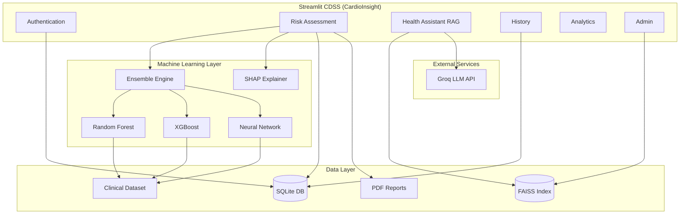

# System Architecture

## High-Level Diagram

## Component Overview

| Layer | Module | Responsibility |
|-------|--------|----------------|
| Frontend | `frontend/streamlit_app.py` | Routing, caching, session |
| Frontend | `frontend/pages/*` | Page-specific presentation |
| Frontend | `frontend/ui/theme.py` | Healthcare design system |
| ML | `machine_learning/pipeline/training.py` | Train RF, XGBoost, ANN |
| ML | `machine_learning/pipeline/preprocessing.py` | Clinical ETL pipeline |
| Backend | `backend/ensemble/ensemble.py` | Weighted ensemble inference |
| Backend | `backend/recommendations/recommendations.py` | Rule-based clinical actions |
| Backend | `backend/rag/rag.py` | FAISS retrieval + Groq |
| Backend | `backend/llm/groq_assistant.py` | LLM client |
| Backend | `backend/database/database.py` | SQLite persistence |
| Backend | `backend/reporting/pdf_report.py` | ReportLab PDF generation |

## Data Flow — Risk Assessment

1. User submits clinical profile via Streamlit form.
2. Features engineered and passed to RF, XGBoost, and ANN.
3. ROC-AUC–weighted ensemble produces final probability.
4. SHAP explains deployment model (XGBoost default).
5. Recommendation engine assigns low/medium/high tier actions.
6. Optional RAG+Groq generates narrative explanation.
7. Results, PDF, and chat context persisted to SQLite.

## Security

- Passwords hashed with bcrypt (never stored plain text).
- Session tokens stored server-side in SQLite.
- User predictions isolated by `user_id` foreign key.

## Deployment Model Selection

XGBoost is deployed when it matches or is within 0.005 ROC-AUC of the best single model on the clinical hold-out set.
